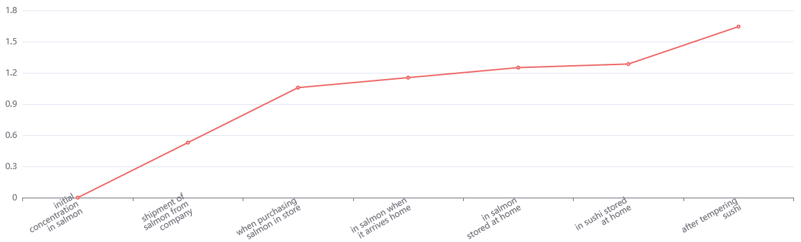

# This is what the calculator does

This calculator illustrates the storage conditions of salmon that result in higher concentrations than 100 Listeria monocytogenes per gram of sushi.

On the tab __Calculator__ you can enter time and temperature data for the steps from slaughter to finished sushi that you have an overview of, and see how big an effect small and large deviations correspond to. 

The calculator is not a substitute for other requirements in the regulations, only a supplement.

# The Reference Case

The starting data in the calculator are a reference scenario that is also presented in the figure. This scenario reflects an example of reasonably foreseeable conditions of storage in the different steps from the fish filleting facility to the fish is brought home, stored in the refrigerator, and prepared for sushi. Sushi does in our case mean combinations of raw fish fillet and acid marinated rice.  

When the initial concentration of Listeria in the fish fillet is 1 cfu/g fish, the concentration will be below 100 cfu/g when the sushi is consumed. The conditions in the reference scenario numbers for the reference criteria are given in the table below. 

By comparing other scenarios with the reference scenarios, it is possible to assess which steps that cause large deviations, and where a change of time or temperature will have a positive or negative effect on the final concentration of Listeria monocytogenes. 

| Location                               | Temperature  | Period   |
|----------------------------------------|--------------|----------|
| Storage in a salmon production company | 4            | 4 days   |
| Time in store                          | 4            | 3 days   |
| Transport home                         | 10           | 3 hours  |
| Storing salmon in a refrigerator       | 10           | 3 hours  |
| Storing sushi in a refrigerator        | 4            | 12 hours |
| Tempering period                       | 22           | 6 hours  |

Initial concentration is set to 1, and  Percentage of salmon in sushi is set to 20%.

Please note that the reference case will remain the same in the plot also when other input numbers are inserted in the table. 

## Learn more 

Do you want to understand how the calculator is built? See background data on the __About__ tab for the calculations.
